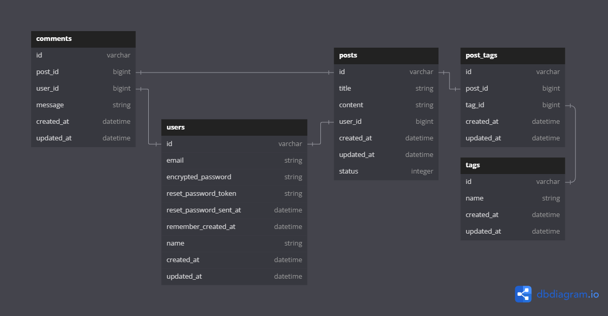

# Blog
Uma app web para publicação de posts feita com Ruby on Rails, PostgreSQL, Redis, Sidekiq e HTML/CSS/JS.

- [Instalação](#instalação)
- [Testes](#testes)
- [App](#app)
  - [Web](#web)
  - [Sidekiq](#sidekiq)
  - [Redis](#redis)
- [Banco de Dados](#banco-de-dados)
  - [Diagrama de Entidade-Relacionamento](#diagrama-de-entidade-relacionamento)
  - [Popular o banco de dados](#popular-o-banco-de-dados)
- [Deploy](#deploy)	
- [Melhorias futuras](#melhorias-futuras)
- [Motivações](#motivações)

## Instalação

### Requisitos
- Git
- Docker
- Ruby 3.3.0

### Clone o repositório e entre na pasta
```bash
git clone
cd blog
```

### Initialize os serviços
Execute o comando para subir as aplicações:
```bash
docker compose up -d
```
Com isso, será criado:
  - Um container com o PostgreSQL rodando na porta 5432.
  - Um container com o Redis

Logo após, execute o comando para criar o banco de dados e rodar as migrações:
```bash
bin/setup
```
Com a execução desse comando as tabelas do banco de dados serão criadas. Em seguida, execute o comando para iniciar o servidor:
```bash
bin/rails s
```
Acesse a aplicação em `http://localhost:3000`.

## Testes
Com o servidor criado, execute o comando para rodar os testes:
```
bundle exec rspec
```
Os testes do backend são feitos com RSpec e após a execução, um relatório de cobertura é gerado na pasta `coverage`. Acesse o arquivo `index.html` para visualizar a cobertura dos testes.

## App

### Web
A aplicação web é uma aplicação Rails que fornece as seguintes funcionalidades:
- Área deslogada onde é possível:
  - Ver os posts publicados por todos os usuários ordenados do mais novo para o mais antigo.
  - Fazer comentários anônimos.
  - Cadastrar um novo usuário.
  - Fazer login com um usuário cadastrado.
  - Recuperar a senha do usuário, enviando um email com um link para redefinição da senha.
- Área logada onde é possível:
  - Redigir e publicar um post.
  - Fazer comentários identificados através do login.
  - Editar e apagar posts já publicados pelo próprio usuário loggado.
  - Editar o seu cadastro de usuário.
  - Alterar a senha do usuário loggado.
- Os posts publicados têm paginação ao atingirem 3 publicações, onde o 4º post irá para a página 2 e daí em diante, ou seja, cada página tem até 3 posts.
- Internacionalização. Onde é possível mudar o idioma da aplicação para português ou inglês.
- Tags. É possível adicionar tags aos posts e filtrar os posts por tags.
- Upload de arquivo TXT para criação de um ou mais posts. O arquivo deve seguir o formato:
  ```
  title: Título do post
  content: Conteúdo do post
  tags: tag1, tag2, tag3
  ---
  title: Título do post 2
  content: Conteúdo do post 2
  tags: tag1, tag2
  ```
  O arquivo deve ser enviado na página de criação de posts.

### Sidekiq
O Sidekiq é um serviço que processa os jobs de envio de email. Ele é utilizado para criar publicações que são enviadas através da opção 'publicar de um arquivo .txt' em segundo plano, evitando que a aplicação fique travada enquanto os posts são criados. É possível visualizar o status dos jobs em `http://localhost:3000/sidekiq` com o usuário `admin` e senha `admin`.

### Redis
O Redis é um banco de dados em memória que é utilizado pelo Sidekiq para armazenar os jobs.

## Banco de Dados
O banco de dados utilizado é o PostgreSQL.

### Diagrama de Entidade-Relacionamento
As tabelas do banco de dados foram modeladas de acordo com o diagrama de entidade-relacionamento a seguir:



### Popular o banco de dados
Com o servidor criado, execute o script para popular o banco de dados com dados de teste:
```bash
bin/rails db:seed
```

## Deploy
A aplicação está hospedada no Render e pode ser acessada em [www.pauloh.tech](https://www.pauloh.tech).

## Melhorias futuras
- Foto de perfil.
- Página de perfil do usuário.
- Visualizar posts de outros usuários.
- Apagar comentários.
- Menu lateral na homepage com tags mais utilizadas.
- Busca por conteúdo dos posts.
- Explicação sobre formato publicação via arquivo TXT.
- Adicionar CI/CD.

## Motivações

## Testes:
A aplicação foi desenvolvida utilizando TDD, onde os testes são escritos antes da implementação do código. Isso garante que a aplicação está funcionando corretamente e que novas funcionalidades não quebram as existentes. Também foi utilizado o RSpec para testes de integração e unitários. Além disso, foi utilizado o SimpleCov para gerar um relatório de cobertura de testes. Com isso, é possível visualizar a porcentagem de código coberto pelos testes. Foi utilizado o FactoryBot para criação de objetos de teste e o Faker para gerar dados aleatórios. Os testes utilizam a metodologia AAA (Arrange, Act, Assert) para organizar os testes. Eles são organizados em contextos, onde cada contexto representa um cenário de teste autocontido para garantir a legibilidade e manutenibilidade dos testes.

## Internacionalização:
A aplicação foi internacionalizada para que o usuário possa escolher o idioma da aplicação. Para isso, foi utilizado o I18n para traduzir as mensagens da aplicação. A mudança de idioma é feita através de um clique na bandeira do idioma no navbar da aplicação. Todos os textos da aplicação foram traduzidos para português e inglês. A funcionalidade tem o seguinte fluxo:
  - O usuário acessa a aplicação e a página é carregada no idioma padrão (português).
  - O usuário clica na bandeira do idioma desejado.
  - A aplicação salva o idioma escolhido na sessão do usuário.
  - A aplicação recarrega a página no idioma escolhido e define o idioma como padrão para as próximas visitas.

## Tags:
Foi implementada a funcionalidade de adicionar tags aos posts. As tags são adicionadas ou atribuídas na criação do post e são exibidas na página de visualização do post. O usuário pode clicar em uma tag e será redirecionado para uma página com todos os posts que possuem aquela tag. A funcionalidade tem o seguinte fluxo:
  - O usuário cria um post e adiciona tags a ele.
  - O post é salvo no banco de dados com as tags.
  - O usuário clica em uma tag e é redirecionado para uma página com todos os posts que possuem aquela tag.  

## Upload de arquivo TXT:
Foi implementada a funcionalidade de upload de arquivo TXT para criação de um ou mais posts. O arquivo deve seguir o formato:
  ```
  title: Título do post
  content: Conteúdo do post
  tags: tag1, tag2, tag3
  ---
  title: Título do post 2
  content: Conteúdo do post 2
  tags: tag1, tag2
  ```
  O arquivo deve ser enviado na página de criação de posts. A funcionalidade tem o seguinte fluxo:
  - O usuário acessa a página de criação de posts.
  - O usuário clica no botão 'Publicar de um arquivo .txt'.
  - O usuário seleciona o arquivo TXT com os posts.
  - É feita a validação do arquivo e o usuário é notificado caso o arquivo não esteja no formato correto.
  - É criado um job no Sidekiq para processar a criação dos posts em segundo plano.
  - O usuário é recebido com uma mensagem de sucesso informando que os posts estão sendo criados.
